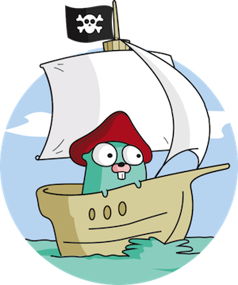

# PirateGopher

Ransomware written in Go. Using this for training purposes and personal learning. Don't use this to
hold people for ransom.

### Current Features

* Create ransomware EXE for Windows
* Create C2 server for Linux
* Use AES-256 for encrypting files
* Encrypts wide variety of valuable file extensions (see `ransomware.go` for list of extensions)

### Future Features:

* Create ELF ransomware for Linux
* Create C2 server for Linux
* Embed executable into various payloads (Unicorn downgrade, Pdf, Office Macro, etc.)
* Variety of crypto solutions

Using this for training purposes and personal learning. Don't use this to hold people for ransom.

## Prerequisites
* Go 1.12
* Linux OS to host server
* Windows OS to run ransomware & unlocker

## Instructions

1) Modify `SERVER_HOST` at top of `make` to match the IP address that you will host the server.
2) Run `make` to create all the things
3) Copy `ransomware.exe` and `unlocker.exe` over to the victim environment. Run `ransomware.exe` 
to encrypt all the things.
4) Query the web server with the appropriate ID at http://SERVER:PORT/api/keys/id to get the
decryption key.
5) Run `unlocker.exe` on the victim. Enter the decryption key to decrypt the files.

## License

[LICENSE](LICENSE)

## Credits

Used https://github.com/mauri870/ransomware as a starting point
